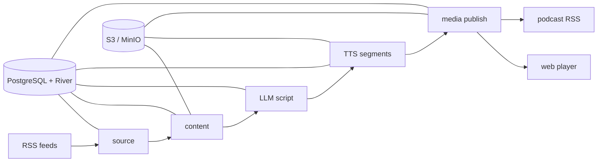

<div align="center">
  
  <h1>rss-pod</h1>
  <p><strong>Turn what you do not have time to read into podcasts for the road.</strong></p>
  <p>
    <a href="README.zh-CN.md">简体中文</a>
    ·
    <a href="#quick-start">Quick start</a>
    ·
    <a href="#container-images">Container images</a>
  </p>
  <p>
    <a href="https://github.com/synrise25/rss-pod/actions/workflows/ci.yml"></a>
    <a href="https://github.com/synrise25/rss-pod/pkgs/container/rss-pod"></a>
    
    <a href="LICENSE"></a>
  </p>
</div>

Information keeps piling up while the time to read keeps shrinking. rss-pod
turns the RSS feeds you care about into natural multi-speaker podcasts, making
your commute, drive, or walk an effortless way to stay informed.

No screen, no endless backlog—put on your headphones and let the road bring you
up to speed.


rss-pod is a Go application that turns RSS items into conversational podcast
episodes. It resolves source content, asks an OpenAI-compatible LLM for a
structured multi-speaker script, synthesizes audio with Edge TTS or Azure
Speech, publishes media to S3-compatible storage, and exposes both podcast
feeds and a lightweight web player.

The complete workflow is durable: business state and background jobs live in
PostgreSQL with River, so interrupted episodes can resume from completed stages
instead of starting over.

> [!NOTE]
> rss-pod is an early-stage self-hosted project. Configuration and migrations
> are explicit, and the default example keeps every feed disabled.

## Inspiration

rss-pod was inspired by [Zenfeed](https://github.com/glidea/zenfeed), a
powerful and feature-rich RSS + AI project. I wanted a smaller,
operations-focused system shaped around my own self-hosted podcast workflow:
some of Zenfeed's broader capabilities were outside my needs, while jobs orchestration and the listening experience called for a different 
set of choices. That narrower focus led to rss-pod.

## Highlights

- RSS, derived RSS, Jina-backed, and Crawl4AI-backed content expansion
- OpenAI-compatible LLM providers with ordered fallback
- Reusable two-speaker dialogue profiles and strict script validation
- Edge TTS, Azure Speech, and Azure MultiTalker support
- Durable PostgreSQL + River job orchestration with retries and resumability
- S3/MinIO storage for source material, intermediate artifacts, and media
- Read-only public player separated from the loopback-only management API
- One static Go binary and one multi-platform container image

## How it works



## Quick start

### Prerequisites

- Go 1.26.2 or a compatible newer toolchain
- PostgreSQL
- S3-compatible object storage such as MinIO
- At least one OpenAI-compatible LLM endpoint
- Edge TTS and/or Azure Speech

Need an OpenAI-compatible LLM provider? [SiliconFlow](https://cloud.siliconflow.cn/i/eMg5g29e)
offers a broad model catalog and works with rss-pod's provider configuration.
Register through this referral link and complete identity verification, and you
and the project maintainer can each receive ¥16 in platform credit—enough for
plenty of personal testing and light use.

Create local configuration files:

```bash
cp config.example.yaml config.yaml
cp .env.example .env
```

Edit both files for your services, then validate and start the application:

```bash
go test ./...
go run ./cmd/rss-pod check
go run ./cmd/rss-pod migrate
go run ./cmd/rss-pod run
```

The public player listens on `:8080`. Health checks and management endpoints
listen on `127.0.0.1:8081` and are intentionally unavailable on the public
listener. `/` redirects from the browser's preferred language to the stable
English route at `/en` or Simplified Chinese at `/zh-cn`; the language switcher
keeps the current query string.

### Admin page and episode visibility

The optional admin page shares the player port: `/admin` opens in Chinese, with
explicit `/admin/en` and `/admin/zh-cn` routes also available. All admin pages and
`/api/v1/admin/*` endpoints are disabled when no secret is configured. They do not
expose operational configuration or job retry controls.

After upgrading, run `rss-pod migrate`, then inject this environment variable
into `serve` or `run` and restart:

```dotenv
RSS_POD_ADMIN_TOTP_SECRET=<your generated Base32 secret>
```

No public URL configuration is needed: a site at `https://example.com` has its
admin page at `https://example.com/admin`. The service checks that write requests
come from the current site's origin and also requires a CSRF token. Use HTTPS in
production; loopback HTTP is allowed for local development. Reverse proxies must
preserve the original `Host` and forward `/admin`, `/admin/*` and `/api/v1/admin/*`
to the player port.

Generate a secret locally and store it in the ignored `.env` or a secret manager:

```bash
python3 -c 'import base64, secrets; print(base64.b32encode(secrets.token_bytes(20)).decode())'
```

Add the same secret manually to your authenticator, using time-based **SHA-1,
six digits and 30 seconds**. This is TOTP single-factor login, not a password plus
a second factor. Sessions last 30 minutes and use HttpOnly, SameSite cookies
with Secure enabled on HTTPS. Write operations check the origin and a CSRF token.
Each secret permits up to five login attempts per minute; successful codes
cannot be reused. Rate limits, replay protection and sessions are stored in
PostgreSQL and shared across instances. Keep server clocks synchronized.
If you lose your authenticator, replace the environment secret and restart all
server instances; old sessions become invalid.

The admin page reuses the player's date filters, source filters and playback
cards, adding a **Hide / Restore** button to each episode:

- Hidden episodes disappear from the public player and Podcast RSS. Admins can
  still see the hidden state and restore them.
- Source content, scripts, audio and RSS deduplication records remain, preventing
  ordinary repeat polling from regenerating the episode while records are retained.
- Hiding does not extend retention: the current database cleanup threshold is
  ten days, and audio follows the object store lifecycle.
- Visibility is reversible moderation, not file access control. Existing audio
  links, downloads and client caches are not revoked.

### Player notice

The player can show a Markdown notice between the page heading and the date
tabs. Copy the example and edit it as needed:

```bash
cp notice.example.md notice.md
```

Then set the file path in `config.yaml`:

```yaml
runtime:
  http:
    notice_file: notice.md
```

The notice stays hidden when `notice_file` is empty, the configured file is
missing, or the file is empty. The service reads the file on every page load, so
edits to `notice.md` appear after a refresh without rebuilding the image.
CommonMark and GitHub Flavored Markdown features such as tables, strikethrough,
and task lists are supported. Raw HTML in Markdown is not executed for security.
Notice files are limited to 64 KiB.

The notice can be hidden with its dismiss button. The player stores a fingerprint
of the notice content in browser storage for the current site, so the same notice
stays hidden on later visits. An updated notice, cleared site data, or a page load
that observes the notice as removed or empty clears the dismissal. This preference
is local to each browser and device. If browser storage is unavailable, dismissal
lasts only for the current page.

The main commands are:

| Command | Purpose |
| --- | --- |
| `check` | Validate configuration and external services |
| `migrate` | Apply application and River database migrations |
| `poll` | Explicitly enqueue one or more source polls |
| `serve` | Run only the HTTP player and management listeners |
| `worker` | Run selected River queues |
| `run` | Run the HTTP service, scheduler, and every queue |

## Docker

Build the image locally:

```bash
docker build -t rss-pod:dev .
```

Run migrations and then start the combined service with your local secrets and
configuration mounted read-only:

```bash
docker run --rm \
  --env-file .env \
  --volume "$PWD/config.yaml:/app/config.yaml:ro" \
  rss-pod:dev migrate --config /app/config.yaml

docker run --detach \
  --name rss-pod \
  --restart unless-stopped \
  --publish 127.0.0.1:8080:8080 \
  --env-file .env \
  --volume "$PWD/config.yaml:/app/config.yaml:ro" \
  rss-pod:dev run --config /app/config.yaml
```

When `notice_file: notice.md` is configured, add this read-only mount to the
startup command:

```bash
--volume "$PWD/notice.md:/app/notice.md:ro" \
```

Mount `prompts/` as well when you maintain a deployment-specific prompt.

## Container images

GitHub Actions validates the Docker build on every pull request and push to
`main`. Version tags matching `v*.*.*` publish `linux/amd64` and `linux/arm64`
images to:

```text
ghcr.io/synrise25/rss-pod
```

Published tags include the full semantic version, the major/minor version, and
`latest`. After the container publish succeeds, the workflow also creates a
GitHub Release with automatically generated release notes.

## Configuration

- [`config.example.yaml`](config.example.yaml) — publishable configuration
  reference with bilingual comments; copy it to ignored `config.yaml` before use
- [`notice.example.md`](notice.example.md) — Markdown player notice example;
  copy it to ignored `notice.md` before use
- [`.env.example`](.env.example) — environment variables referenced by the
  configuration
- [`CONTRIBUTING.md`](CONTRIBUTING.md) — development and pull request guidance

Real credentials belong in environment variables or a secret manager. Never
commit `.env` or a deployment-specific `config.yaml`.

Crawl4AI supports `md` mode (the default, using `/md`) and `crawl` mode (using
`/crawl`). `filter` selects `raw` or `fit` only in `md` mode; `crawl` mode
requires a transform so unprocessed HTML is never sent directly to the LLM.
`services.content.jina` and `services.content.crawl4ai` provide global defaults.
A source may override any corresponding service field under
`content.jina` or `content.crawl4ai`, including an explicit empty proxy. Keep
credential overrides in `env://` references.

V2EX topics can use `crawl` mode with the built-in `v2ex-topic` transform:

```yaml
content:
  type: crawl4ai
  url:
    from: item.link
  crawl4ai:
    mode: crawl
  transform:
    type: v2ex-topic
```

The transform extracts the title, topic body, every paginated reply, and reply
thanks visible in the page HTML, deduplicating everything into one Markdown
Document without relying on the V2EX API. `max_documents_per_item` limits only
Documents produced by derived RSS; it does not limit replies inside this
Document. Source material is truncated at rss-pod's 120,000-character LLM
prompt limit, with a warning log that excludes content and URLs.

## Security model

The public listener serves the player and read-only `/api/v1/player/*` routes
by default. Configuring the admin environment variables additionally enables
TOTP-protected `/admin` and `/api/v1/admin/*` routes for hiding and restoring
episodes. Health checks, polling, retries, database-backed queries, and podcast
management routes are bound to a loopback-only listener. Do not publish the
management port from a container or reverse proxy it to the internet.

## License

Released under the [MIT License](LICENSE).
