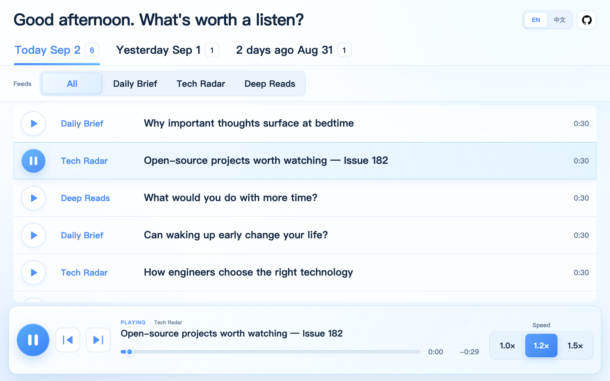
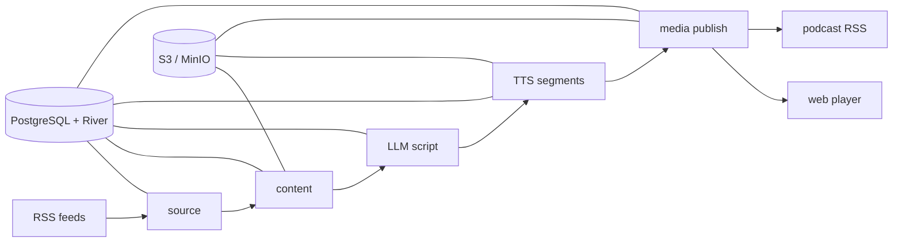

<div align="center">
  
  <h1>rss-pod</h1>
  <p><strong>Turn what you do not have time to read into podcasts for the road.</strong></p>
  <p>
    <a href="README.zh-CN.md">简体中文</a>
    ·
    <a href="#quick-start">Quick start</a>
    ·
    <a href="#container-images">Container images</a>
  </p>
  <p>
    <a href="https://github.com/synrise25/rss-pod/actions/workflows/ci.yml"></a>
    <a href="https://github.com/synrise25/rss-pod/pkgs/container/rss-pod"></a>
    
    <a href="LICENSE"></a>
  </p>
</div>

Information keeps piling up while the time to read keeps shrinking. rss-pod
turns the RSS feeds you care about into natural multi-speaker podcasts, making
your commute, drive, or walk an effortless way to stay informed.

No screen, no endless backlog—put on your headphones and let the road bring you
up to speed.



rss-pod is a Go application that turns RSS items into conversational podcast
episodes. It resolves source content, asks an OpenAI-compatible LLM for a
structured multi-speaker script, synthesizes audio with Edge TTS or Azure
Speech, publishes media to S3-compatible storage, and exposes both podcast
feeds and a lightweight web player.

The complete workflow is durable: business state and background jobs live in
PostgreSQL with River, so interrupted episodes can resume from completed stages
instead of starting over.

> [!NOTE]
> rss-pod is an early-stage self-hosted project. Configuration and migrations
> are explicit, and the default example keeps every feed disabled.

## Inspiration

rss-pod was inspired by [Zenfeed](https://github.com/glidea/zenfeed), a
powerful and feature-rich RSS + AI project. I wanted a smaller,
operations-focused system shaped around my own self-hosted podcast workflow:
some of Zenfeed's broader capabilities were outside my needs, while jobs orchestration and the listening experience called for a different 
set of choices. That narrower focus led to rss-pod.

## Highlights

- RSS, derived RSS, and Jina-backed content expansion
- OpenAI-compatible LLM providers with ordered fallback
- Reusable two-speaker dialogue profiles and strict script validation
- Edge TTS, Azure Speech, and Azure MultiTalker support
- Durable PostgreSQL + River job orchestration with retries and resumability
- S3/MinIO storage for source material, intermediate artifacts, and media
- Read-only public player separated from the loopback-only management API
- One static Go binary and one multi-platform container image

## How it works



## Quick start

### Prerequisites

- Go 1.26.2 or a compatible newer toolchain
- PostgreSQL
- S3-compatible object storage such as MinIO
- At least one OpenAI-compatible LLM endpoint
- Edge TTS and/or Azure Speech

Need an OpenAI-compatible LLM provider? [SiliconFlow](https://cloud.siliconflow.cn/i/eMg5g29e)
offers a broad model catalog and works with rss-pod's provider configuration.
Register through this referral link and complete identity verification, and you
and the project maintainer can each receive ¥16 in platform credit—enough for
plenty of personal testing and light use.

Create local configuration files:

```bash
cp config.example.yaml config.yaml
cp .env.example .env
```

Edit both files for your services, then validate and start the application:

```bash
go test ./...
go run ./cmd/rss-pod check
go run ./cmd/rss-pod migrate
go run ./cmd/rss-pod run
```

The public player listens on `:8080`. Health checks and management endpoints
listen on `127.0.0.1:8081` and are intentionally unavailable on the public
listener. The player uses English at `/` and Simplified Chinese at `/zh-cn`;
the language switcher keeps the current query string.

The main commands are:

| Command | Purpose |
| --- | --- |
| `check` | Validate configuration and external services |
| `migrate` | Apply application and River database migrations |
| `poll` | Explicitly enqueue one or more source polls |
| `serve` | Run only the HTTP player and management listeners |
| `worker` | Run selected River queues |
| `run` | Run the HTTP service, scheduler, and every queue |

## Docker

Build the image locally:

```bash
docker build -t rss-pod:dev .
```

Run migrations and then start the combined service with your local secrets and
configuration mounted read-only:

```bash
docker run --rm \
  --env-file .env \
  --volume "$PWD/config.yaml:/app/config.yaml:ro" \
  rss-pod:dev migrate --config /app/config.yaml

docker run --detach \
  --name rss-pod \
  --restart unless-stopped \
  --publish 127.0.0.1:8080:8080 \
  --env-file .env \
  --volume "$PWD/config.yaml:/app/config.yaml:ro" \
  rss-pod:dev run --config /app/config.yaml
```

Mount `prompts/` as well when you maintain a deployment-specific prompt.

## Container images

GitHub Actions validates the Docker build on every pull request and push to
`main`. Version tags matching `v*.*.*` publish `linux/amd64` and `linux/arm64`
images to:

```text
ghcr.io/synrise25/rss-pod
```

Published tags include the full semantic version, the major/minor version, and
`latest`. After the container publish succeeds, the workflow also creates a
GitHub Release with automatically generated release notes.

## Configuration

- [`config.example.yaml`](config.example.yaml) — publishable configuration
  reference with bilingual comments; copy it to ignored `config.yaml` before use
- [`.env.example`](.env.example) — environment variables referenced by the
  configuration
- [`CONTRIBUTING.md`](CONTRIBUTING.md) — development and pull request guidance

Real credentials belong in environment variables or a secret manager. Never
commit `.env` or a deployment-specific `config.yaml`.

## Security model

The public listener serves only the player and read-only `/api/v1/player/*`
routes. Health checks, polling, retries, database-backed queries, and podcast
management routes are bound to a loopback-only listener. Do not publish the
management port from a container or reverse proxy it to the internet.

## License

Released under the [MIT License](LICENSE).
