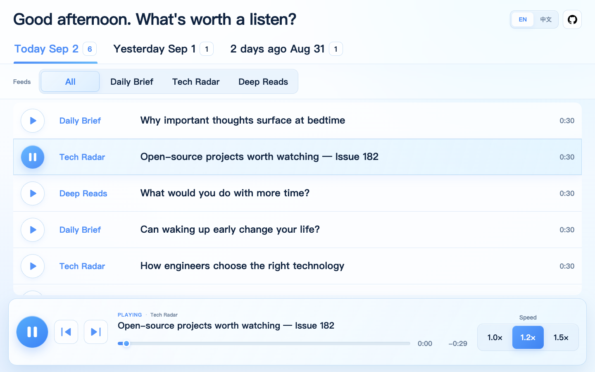
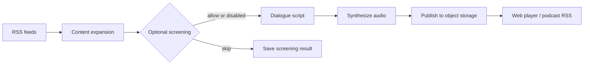

<div align="center">
  
  <h1>rss-pod</h1>
  <p><strong>Turn what you do not have time to read into podcasts for the road.</strong></p>
  <p>
    <a href="README.zh-CN.md">简体中文</a>
    ·
    <a href="#quick-start">Quick start</a>
    ·
    <a href="#configuration">Configuration</a>
  </p>
  <p>
    <a href="https://github.com/synrise25/rss-pod/actions/workflows/ci.yml"></a>
    <a href="https://github.com/synrise25/rss-pod/pkgs/container/rss-pod"></a>
    
    <a href="LICENSE"></a>
  </p>
</div>

rss-pod is a self-hosted RSS-to-podcast app. It uses an OpenAI-compatible LLM to
turn content into multi-speaker conversations, synthesizes audio with Edge TTS
or Azure Speech, and provides a web player and podcast RSS feeds. Listen to the
content you care about during your commute, drive, or walk.



## Highlights

- Content expansion through direct RSS, derived RSS, Jina, and Crawl4AI
- Ordered LLM fallback and optional content screening before generation
- Custom dialogue roles and voices, with Edge TTS, Azure Speech, and Azure MultiTalker
- PostgreSQL + River for durable progress, automatic retries, and resumability
- S3/MinIO storage for source content, scripts, and audio
- English and Chinese player, with an optional admin page for episode visibility and screening results
- Run with one Go binary or Docker container

## How it works


```mermaid
flowchart LR
    RSS[RSS feeds] --> Content[Content expansion]
    Content --> Screening{Optional screening}
    Screening -->|allow or disabled| LLM[Dialogue script]
    Screening -->|skip| Skipped[Save screening result]
    LLM --> TTS[Synthesize audio]
    TTS --> Publish[Publish to object storage]
    Publish --> Player[Web player / podcast RSS]
```

Progress is stored in PostgreSQL. After a restart or temporary provider failure,
episodes can continue from completed stages.

## Quick start

### 1. Prepare services and configuration

You need PostgreSQL, S3-compatible storage, at least one OpenAI-compatible LLM,
and Edge TTS or Azure Speech. The steps below use Docker, so Go is not required
on the host. Provision the external services separately.

```bash
git clone https://github.com/synrise25/rss-pod.git
cd rss-pod
cp config.example.yaml config.yaml
cp .env.example .env
```

Edit the two local files:

- `.env`: fill in connection settings and credentials for your database, storage, and chosen LLM.
- `config.yaml`: confirm the database name and storage buckets. Create the
  `rsspod-private` and `rsspod-media` buckets, and make media under
  `PUBLIC_MEDIA_BASE_URL` publicly readable. Use a non-superuser database account.
- Start with one LLM service, such as `deepseek`, and set `defaults.llm` to
  `[deepseek]`. You can keep the example service name while using any compatible
  provider's endpoint and model.
- Start with the `zhihu-daily` source: replace `feed.url` with your RSS URL and
  set `enabled: true`. Its voices use Edge TTS, so Azure is not needed. Leave
  other sources disabled.

All example sources are disabled by default. `check` verifies the database,
storage, and content services, LLMs, screening backends, and voice profiles used
by enabled sources. Unused services do not receive external checks.
Database and storage addresses must be reachable from the container; the
example's `127.0.0.1` addresses do not point to the host from inside a container.

Need an LLM provider? You can register through this
[SiliconFlow referral link](https://cloud.siliconflow.cn/i/eMg5g29e). You and the
maintainer may receive credits when the platform's promotion conditions are met.

### 2. Check and start

Build from the current checkout so the image matches its configuration example:

```bash
docker build -t rss-pod:local .

docker run --rm \
  --env-file .env \
  --volume "$PWD/config.yaml:/app/config.yaml:ro" \
  rss-pod:local check

docker run --rm \
  --env-file .env \
  --volume "$PWD/config.yaml:/app/config.yaml:ro" \
  rss-pod:local migrate

docker run --detach \
  --name rss-pod \
  --restart unless-stopped \
  --publish 127.0.0.1:8080:8080 \
  --env-file .env \
  --volume "$PWD/config.yaml:/app/config.yaml:ro" \
  rss-pod:local run
```

Open [http://localhost:8080](http://localhost:8080). The player selects English
or Chinese based on your browser's language. A fresh installation has no
episodes until you trigger generation.

### 3. Generate your first episode

```bash
docker exec rss-pod rss-pod poll --sources zhihu-daily --limit 1
docker logs -f rss-pod
```

`--sources` takes a source's `id`; `--limit 1` processes one RSS item. Generation
runs asynchronously after enqueueing. Refresh the player when it finishes to
listen. Subsequent polls follow the source's `schedule.cron`.

### Other ways to run

Prebuilt images at `ghcr.io/synrise25/rss-pod` support `linux/amd64` and
`linux/arm64`, with version tags and `latest`. For a released image, use the
README and configuration example from the
[matching release](https://github.com/synrise25/rss-pod/releases).

With Go 1.26.2 or a compatible newer toolchain installed, you can run directly
after completing the configuration above:

```bash
go run ./cmd/rss-pod check
go run ./cmd/rss-pod migrate
go run ./cmd/rss-pod run
```

Keep `run` running and execute
`go run ./cmd/rss-pod poll --sources zhihu-daily --limit 1` in another terminal
to generate your first episode.

## Usage and optional features

### Player

The player groups episodes by their task's edition date; overnight queueing and
retries do not change it. Set the timezone with `defaults.schedule.timezone`.
The player opens the latest date with playable episodes and preloads the next
episode to reduce switching delays. Preloading lasts only for the current page.

### Admin page

Sign in at `/admin` to hide or restore episodes and inspect recently skipped
content. The page is disabled by default. To enable it, generate a secret:

```bash
python3 -c 'import base64, secrets; print(base64.b32encode(secrets.token_bytes(20)).decode())'
```

Set `RSS_POD_ADMIN_TOTP_SECRET` in `.env` to the result. Add the same secret to
your authenticator using time-based **SHA-1, six digits, and 30 seconds**.
Login requires only the dynamic code; sessions last 30 minutes. Restart the
local process, or recreate the Docker container to load the new environment.

Hidden episodes disappear from the public player and podcast RSS. Their source
content, scripts, and audio remain, so unexpired episodes can be restored. Hiding does
not extend retention or revoke existing audio links, downloads, or client caches.
If you lose your authenticator, replace the secret and restart the service;
old sessions become invalid. Keep server clocks synchronized.

### Content screening

Screening is disabled by default. To enable it, set `enabled` to `true` under
`defaults.screening` or a source's `screening`. Set `services` to an independent,
ordered chain such as `[llm.deepseek]` or `[jev, llm.deepseek]`. Sources can
override the defaults; see [`config.example.yaml`](config.example.yaml) for fields.

A valid allow/skip decision ends screening. Provider failures try the next
service; if all fail, the task retries. Skipped content produces no script or
audio, and its reason is visible in the admin page.
Jev uses the `JEV_*` connection settings in `.env` and skips when its probability
reaches `jev.skip_threshold`, which defaults to `0.7`. For long content, configure
a fallback LLM with enough input capacity. Pin Jev model versions to avoid
reusing cached decisions after a floating alias changes.

### Player notice

Copy `notice.example.md` to `notice.md` and set
`runtime.http.notice_file: notice.md` to show a Markdown notice. Empty or missing
files produce no notice. Edits appear after a page refresh. Dismissed notices
stay hidden until their content changes.

For Docker, add a read-only mount to the startup command:

```bash
--volume "$PWD/notice.md:/app/notice.md:ro" \
```

## Commands and recovery

| Command | Purpose |
| --- | --- |
| `check` | Validate configuration, shared infrastructure, and services used by enabled sources |
| `migrate` | Apply database migrations |
| `poll --sources <id>` | Poll selected sources; `all` selects every enabled source |
| `run` | Run the web service, scheduler, and all job queues |
| `serve` | Run only the web service and management API |
| `worker` | Run job queues only; select them with `--queues` |

Recover failed or interrupted episodes:

```bash
docker exec rss-pod rss-pod poll --sources zhihu-daily --resume-incomplete
```

Recovery covers the current RSS poll scope and reuses saved content, scripts,
and audio segments. Published or skipped episodes and those with active jobs
are not enqueued again.

## Configuration

- [`config.example.yaml`](config.example.yaml): complete reference with English
  and Chinese comments, including Crawl4AI, V2EX expansion, and screening examples.
- [`.env.example`](.env.example): connection settings and credential variables.
- [`notice.example.md`](notice.example.md): sample player notice.
- [`CONTRIBUTING.md`](CONTRIBUTING.md): development, testing, and contribution guide.

Customize roles and voices with `dialogue_profiles` and script templates with
`prompts/`. Deployment-specific prompts can be mounted read-only at `/app/prompts`.
Keep real configuration and credentials in local `config.yaml`, `.env`, or a
secret manager; never commit them.

## Security model

The player listens on `:8080`. Setting an admin secret enables code-protected
admin routes on the same port. Health checks, polling, retries, and podcast
management routes listen on `127.0.0.1:8081`; do not expose or proxy that listener
to the internet. Use HTTPS for public access. Point reverse proxies at the
player port and preserve the original `Host`.

## Inspiration

rss-pod was inspired by [Zenfeed](https://github.com/glidea/zenfeed). It focuses
on my self-hosted podcast workflow, with different choices around job
orchestration and the listening experience.

## License

Released under the [MIT License](LICENSE).
