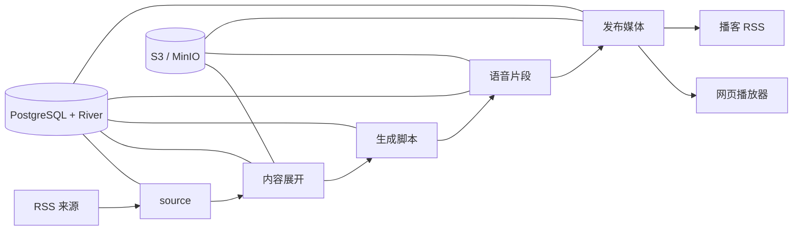

<div align="center">
  
  <h1>rss-pod</h1>
  <p><strong>把来不及读的信息，变成路上听得完的播客。</strong></p>
  <p>
    <a href="README.md">English</a>
    ·
    <a href="#快速开始">快速开始</a>
    ·
    <a href="#容器镜像">容器镜像</a>
  </p>
  <p>
    <a href="https://github.com/synrise25/rss-pod/actions/workflows/ci.yml"></a>
    <a href="https://github.com/synrise25/rss-pod/pkgs/container/rss-pod"></a>
    
    <a href="LICENSE"></a>
  </p>
</div>

信息不断涌来，真正能留给阅读的时间却越来越少。rss-pod 把你关心的 RSS 内容整理成自然的多人对话播客，让通勤、开车和散步的时间，变成轻松了解世界的一段声音。

不用盯着屏幕，也不必逐篇追赶——戴上耳机，把纷繁的信息交给路上的时间。


rss-pod 是一个用 Go 编写的 RSS 转播客应用。它会展开 RSS 内容，通过兼容 OpenAI
协议的 LLM 生成结构化多人对话脚本，再使用 Edge TTS 或 Azure Speech 合成音频，
将媒体发布到 S3/MinIO，并同时提供播客 RSS 与轻量网页播放器。

业务状态和后台任务保存在 PostgreSQL 与 River 中。进程重启或外部服务临时失败后，
节目可以从已经完成的阶段继续，不需要整条链路从头生成。

> [!NOTE]
> rss-pod 目前仍是早期自托管项目。迁移和配置都采用显式操作；公开示例配置中的
> RSS 来源默认全部关闭，避免意外调用外部或付费服务。

## 项目缘起

本项目受到 [Zenfeed](https://github.com/glidea/zenfeed) 启发。Zenfeed 是一个功能完整、
能力很强的 RSS + AI 项目；但在实际使用中，我更希望有一个范围更聚焦、围绕自己的自托管播客流程设计的实现：Zenfeed 的部分扩展能力并非我的必需项，而我对任务编排、收听体验等又有一些不同需求，于是有了 rss-pod。

## 主要能力

- 支持直接 RSS、派生 RSS、Jina 和 Crawl4AI 内容展开
- 支持多个兼容 OpenAI 协议的 LLM，并按顺序回退
- 可复用的双人对话角色配置和严格脚本校验
- 支持 Edge TTS、Azure Speech 与 Azure MultiTalker
- PostgreSQL + River 持久任务、自动重试和断点续跑
- 使用 S3/MinIO 保存原文、中间产物和最终媒体
- 公共只读播放器与回环管理 API 分离
- 一个静态 Go 二进制和一个多架构容器镜像

## 工作流程



## 快速开始

### 前置条件

- Go 1.26.2 或兼容的新版本工具链
- PostgreSQL
- MinIO 等兼容 S3 的对象存储
- 至少一个兼容 OpenAI 协议的 LLM 服务
- Edge TTS 和/或 Azure Speech

如果还没有兼容 OpenAI 协议的 LLM 服务，可以试试
[硅基流动](https://cloud.siliconflow.cn/i/eMg5g29e)。通过这个推广链接注册并完成实名认证后，
你和项目维护者都可以获得 16 元平台额度；对于个人测试和轻量使用，通常可以用很久。

复制本地配置：

```bash
cp config.example.yaml config.yaml
cp .env.example .env
```

填写自己的服务地址和凭据，然后执行：

```bash
go test ./...
go run ./cmd/rss-pod check
go run ./cmd/rss-pod migrate
go run ./cmd/rss-pod run
```

公共播放器监听 `:8080`。健康检查和管理接口监听 `127.0.0.1:8081`，不会出现在
公共 listener 上。播放器会在 `/` 根据浏览器首选语言跳转到稳定的英文地址 `/en` 或
简体中文地址 `/zh-cn`；页面语言切换会保留当前查询参数。

### 播放器通知

播放器可以在页面标题与日期标签之间显示一段 Markdown 通知。先复制示例并按需修改：

```bash
cp notice.example.md notice.md
```

再在 `config.yaml` 中设置文件路径：

```yaml
runtime:
  http:
    notice_file: notice.md
```

`notice_file` 留空、配置的文件不存在，或文件内容为空时，都不显示通知。服务会在
每次页面载入时重新读取文件，因此修改 `notice.md` 后刷新页面即可看到新内容，
不需要重新构建镜像。支持 CommonMark 与表格、删除线、任务列表等 GitHub Flavored
Markdown 语法；出于安全考虑，Markdown 中的原始 HTML 不会执行。通知文件最大为 64 KiB。

通知可以通过右侧的关闭按钮隐藏。播放器会在当前站点的浏览器本地存储中记录通知内容指纹；
只要通知内容没有变化，之后打开页面时都会保持隐藏。通知更新、清理站点数据，或页面载入时检测到
通知已移除或为空，都会清除关闭状态。该状态按浏览器和设备独立保存；禁用本地存储时，关闭只对当前页面有效。

主要命令：

| 命令 | 用途 |
| --- | --- |
| `check` | 校验配置和外部服务 |
| `migrate` | 执行应用及 River 数据库迁移 |
| `poll` | 手动创建一个或多个来源拉取任务 |
| `serve` | 只运行 HTTP 播放器和管理 listener |
| `worker` | 只执行指定 River 队列 |
| `run` | 同时运行 HTTP、调度器和全部队列 |

## Docker

本地构建：

```bash
docker build -t rss-pod:dev .
```

先迁移数据库，再启动默认的单容器模式：

```bash
docker run --rm \
  --env-file .env \
  --volume "$PWD/config.yaml:/app/config.yaml:ro" \
  rss-pod:dev migrate --config /app/config.yaml

docker run --detach \
  --name rss-pod \
  --restart unless-stopped \
  --publish 127.0.0.1:8080:8080 \
  --env-file .env \
  --volume "$PWD/config.yaml:/app/config.yaml:ro" \
  rss-pod:dev run --config /app/config.yaml
```

配置了 `notice_file: notice.md` 时，在启动命令中再增加这一项只读挂载：

```bash
--volume "$PWD/notice.md:/app/notice.md:ro" \
```

如果维护了部署专用 Prompt，也可以把本地 `prompts/` 只读挂载到容器。

## 容器镜像

GitHub Actions 会在每次 pull request 和推送到 `main` 时运行测试、静态检查及
Docker 构建。创建符合 `v*.*.*` 的版本标签后，会自动发布 `linux/amd64` 和
`linux/arm64` 镜像到：

```text
ghcr.io/synrise25/rss-pod
```

发布标签包括完整语义版本、主次版本以及 `latest`。镜像成功发布后，工作流还会自动创建
同名 GitHub Release，并生成版本说明。

## 配置

- [`config.example.yaml`](config.example.yaml)：带中英双语注释的公开配置参考；使用前复制为
  被忽略的 `config.yaml`
- [`notice.example.md`](notice.example.md)：播放器 Markdown 通知示例；使用前复制为被忽略的
  `notice.md`
- [`.env.example`](.env.example)：配置文件所引用的环境变量
- [`CONTRIBUTING.md`](CONTRIBUTING.md)：开发与贡献说明

真实凭据只应通过环境变量或 secret manager 注入。不要提交 `.env` 或真实部署使用的
`config.yaml`。

Crawl4AI 支持 `md`（默认，调用 `/md`）和 `crawl`（调用 `/crawl`）两种模式。`filter`
只在 `md` 模式下选择 `raw` 或 `fit`；`crawl` 模式必须配置一个 transform，避免未处理的
HTML 被直接送入 LLM。
`services.content.jina` 与 `services.content.crawl4ai` 提供全局默认值；source 可以在
`content.jina` 或 `content.crawl4ai` 下覆盖对应 service 的任意字段，包括显式使用空字符串
关闭全局代理。建议凭据覆盖仍通过 `env://` 注入。

V2EX 主题可以使用 `crawl` 模式和内置的 `v2ex-topic` transform：

```yaml
content:
  type: crawl4ai
  url:
    from: item.link
  crawl4ai:
    mode: crawl
  transform:
    type: v2ex-topic
```

该 transform 从网页 HTML 提取标题、原帖、全部分页回复及页面上可见的回复感谢数，去重后
合并为一个 Markdown Document，不依赖 V2EX API。`max_documents_per_item` 只限制派生 RSS
生成的 Document 数量，不限制这个 Document 内的回复数。送入 LLM 的资料达到应用层
120,000 字符上限时会截断，并输出一条不含正文和 URL 的 warning 日志。

## 安全边界

公共 listener 只提供播放器和只读 `/api/v1/player/*` 路由。健康检查、手动拉取、重试、
数据库查询和播客管理接口只绑定回环 listener。不要把容器管理端口映射到宿主机公网，
也不要让反向代理转发它。

## 许可证

本项目使用 [MIT License](LICENSE)。
