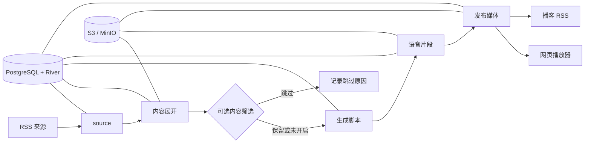

<div align="center">
  
  <h1>rss-pod</h1>
  <p><strong>把来不及读的信息，变成路上听得完的播客。</strong></p>
  <p>
    <a href="README.md">English</a>
    ·
    <a href="#快速开始">快速开始</a>
    ·
    <a href="#容器镜像">容器镜像</a>
  </p>
  <p>
    <a href="https://github.com/synrise25/rss-pod/actions/workflows/ci.yml"></a>
    <a href="https://github.com/synrise25/rss-pod/pkgs/container/rss-pod"></a>
    
    <a href="LICENSE"></a>
  </p>
</div>

信息不断涌来，真正能留给阅读的时间却越来越少。rss-pod 把你关心的 RSS 内容整理成自然的多人对话播客，让通勤、开车和散步的时间，变成轻松了解世界的一段声音。

不用盯着屏幕，也不必逐篇追赶——戴上耳机，把纷繁的信息交给路上的时间。


rss-pod 是一个用 Go 编写的 RSS 转播客应用。它会展开 RSS 内容，通过兼容 OpenAI
协议的 LLM 生成结构化多人对话脚本，再使用 Edge TTS 或 Azure Speech 合成音频，
将媒体发布到 S3/MinIO，并同时提供播客 RSS 与轻量网页播放器。

业务状态和后台任务保存在 PostgreSQL 与 River 中。进程重启或外部服务临时失败后，
节目可以从已经完成的阶段继续，不需要整条链路从头生成。

> [!NOTE]
> rss-pod 目前仍是早期自托管项目。迁移和配置都采用显式操作；公开示例配置中的
> RSS 来源默认全部关闭，避免意外调用外部或付费服务。

## 项目缘起

本项目受到 [Zenfeed](https://github.com/glidea/zenfeed) 启发。Zenfeed 是一个功能完整、
能力很强的 RSS + AI 项目；但在实际使用中，我更希望有一个范围更聚焦、围绕自己的自托管播客流程设计的实现：Zenfeed 的部分扩展能力并非我的必需项，而我对任务编排、收听体验等又有一些不同需求，于是有了 rss-pod。

## 主要能力

- 支持直接 RSS、派生 RSS、Jina 和 Crawl4AI 内容展开
- 支持多个兼容 OpenAI 协议的 LLM，并按顺序回退
- 可复用的双人对话角色配置和严格脚本校验
- 支持 Edge TTS、Azure Speech 与 Azure MultiTalker
- PostgreSQL + River 持久任务、自动重试和断点续跑
- 使用 S3/MinIO 保存原文、中间产物和最终媒体
- 公共只读播放器与回环管理 API 分离
- 一个静态 Go 二进制和一个多架构容器镜像

## 工作流程


```mermaid
flowchart LR
    RSS[RSS 来源] --> Source[source]
    Source --> Content[内容展开]
    Content --> Screening{可选内容筛选}
    Screening -->|保留或未开启| LLM[生成脚本]
    Screening -->|跳过| Skipped[记录跳过原因]
    LLM --> TTS[语音片段]
    TTS --> Media[发布媒体]
    Media --> Player[网页播放器]
    Media --> Feed[播客 RSS]

    DB[(PostgreSQL + River)] --- Source
    DB --- Content
    DB --- LLM
    DB --- TTS
    DB --- Media
    S3[(S3 / MinIO)] --- Content
    S3 --- TTS
    S3 --- Media
```

## 快速开始

### 前置条件

- Go 1.26.2 或兼容的新版本工具链
- PostgreSQL
- MinIO 等兼容 S3 的对象存储
- 至少一个兼容 OpenAI 协议的 LLM 服务
- Edge TTS 和/或 Azure Speech

如果还没有兼容 OpenAI 协议的 LLM 服务，可以试试
[硅基流动](https://cloud.siliconflow.cn/i/eMg5g29e)。通过这个推广链接注册并完成实名认证后，
你和项目维护者都可以获得 16 元平台额度；对于个人测试和轻量使用，通常可以用很久。

复制本地配置：

```bash
cp config.example.yaml config.yaml
cp .env.example .env
```

填写自己的服务地址和凭据，然后执行：

```bash
go test ./...
go run ./cmd/rss-pod check
go run ./cmd/rss-pod migrate
go run ./cmd/rss-pod run
```

公共播放器监听 `:8080`。健康检查和管理接口监听 `127.0.0.1:8081`，不会出现在
公共 listener 上。播放器会在 `/` 根据浏览器首选语言跳转到稳定的英文地址 `/en` 或
简体中文地址 `/zh-cn`；页面语言切换会保留当前查询参数。

节目按任务归属日期分组：定时任务使用计划触发日期，手动任务使用提交入队日期，
统一按 `defaults.schedule.timezone` 计算。排队跨夜、生成耗时和重试不会改变归属日期；
页面默认选择最近有可播放节目的日期。RSS 的发布时间仍是音频实际发布的时间。
升级前的节目暂时按创建日期展示，不追溯原始批次。播放器 API 返回 `edition_date`
（`YYYY-MM-DD`）；`since`（含）和 `before`（不含）按归属日期筛选，支持日期字符串，
原有 RFC3339 时间参数会先转换成配置时区的日期。

播放时，当前音频完整缓冲后，播放器会按当前日期和来源筛选下的顺序，自动预加载下一集。
切换到该集时直接复用已缓冲的音频；更换筛选或跳播会释放不再需要的预加载，最多提前加载一集。
预加载只在当前页面有效，不是离线下载；实际缓冲量受浏览器策略影响，移动端可能限制后台加载。

### 管理员页面与隐藏节目

可选管理员页面与播放器使用相同端口，入口是 `/admin`（中文），也支持 `/admin/en` 和
`/admin/zh-cn`。未设置密钥时，页面和 `/api/v1/admin/*` 接口均不启用。
三个入口带末尾 `/` 时，会自动重定向到无末尾斜杠的地址，并保留查询参数。
它独立于仅回环可访问的运维管理 API，不会开放服务配置或任务重试等运维接口。

升级后先执行 `rss-pod migrate`，再为 `serve` 或 `run` 注入环境变量并重启：

```dotenv
RSS_POD_ADMIN_TOTP_SECRET=<自行生成的 Base32 密钥>
```

无需配置网站地址：主页是 `https://example.com`，管理员入口自动就是
`https://example.com/admin`。服务根据当前请求校验同源，写操作仍需 CSRF token。
线上使用 HTTPS，本机开发允许 `http://localhost:8080` 或回环 IP。反向代理保留原始
`Host`，并将 `/admin`、`/admin/*` 和 `/api/v1/admin/*` 转发给播放器端口即可。

可在自己的终端生成密钥，然后存入被忽略的 `.env` 或 secret manager：

```bash
python3 -c 'import base64, secrets; print(base64.b32encode(secrets.token_bytes(20)).decode())'
```

在验证器中手动添加账户，填入同一密钥，选择基于时间的 **SHA-1、6 位数字、30 秒**。
登录仅需输入动态码；这是 TOTP 单因素登录，并非密码加动态码的双因素认证。
会话有效期为 30 分钟，Cookie 使用 HttpOnly、SameSite 和 HTTPS Secure 属性；
写操作校验来源及 CSRF token。每个密钥每分钟最多尝试 5 次，已成功使用的动态码不能
再次登录，限流与防重放状态保存在 PostgreSQL 中并由多个实例共享。
保持服务器时间同步；遗失验证器时，在服务器更换密钥并重启即可重新配置，也会让旧会话失效。

登录后复用主页的日期、来源筛选和播放卡片，每条节目多出“隐藏／恢复显示”按钮：

- 隐藏后，节目不再出现在公共播放器和 Podcast RSS 中；管理员仍能看到“已隐藏”状态并恢复。
- 原文、脚本、音频与 RSS 去重记录保留，日常重复抓取不会重新生成这条节目。
- 隐藏不延长原有保留期限；当前数据库回收阈值为 10 天，音频仍遵循对象存储生命周期。
- 隐藏是可逆的内容管理操作，不是文件访问控制；已有音频直链、已下载内容或客户端缓存不会被撤回。

### 播放器通知

播放器可以在页面标题与日期标签之间显示一段 Markdown 通知。先复制示例并按需修改：

```bash
cp notice.example.md notice.md
```

再在 `config.yaml` 中设置文件路径：

```yaml
runtime:
  http:
    notice_file: notice.md
```

`notice_file` 留空、配置的文件不存在，或文件内容为空时，都不显示通知。服务会在
每次页面载入时重新读取文件，因此修改 `notice.md` 后刷新页面即可看到新内容，
不需要重新构建镜像。支持 CommonMark 与表格、删除线、任务列表等 GitHub Flavored
Markdown 语法；出于安全考虑，Markdown 中的原始 HTML 不会执行。通知文件最大为 64 KiB。

通知可以通过右侧的关闭按钮隐藏。播放器会在当前站点的浏览器本地存储中记录通知内容指纹；
只要通知内容没有变化，之后打开页面时都会保持隐藏。通知更新、清理站点数据，或页面载入时检测到
通知已移除或为空，都会清除关闭状态。该状态按浏览器和设备独立保存；禁用本地存储时，关闭只对当前页面有效。

主要命令：

| 命令 | 用途 |
| --- | --- |
| `check` | 校验配置和外部服务 |
| `migrate` | 执行应用及 River 数据库迁移 |
| `poll` | 手动创建一个或多个来源拉取任务；可用 `--resume-incomplete` 恢复未完成节目 |
| `serve` | 只运行 HTTP 播放器和管理 listener |
| `worker` | 只执行指定 River 队列 |
| `run` | 同时运行 HTTP、调度器和全部队列 |

### 恢复未完成节目

`poll --resume-incomplete` 会恢复本次 RSS 拉取范围内没有活跃 River 任务的未完成节目，
包括任务被取消或删除后遗留的 `content_ready`、`script_ready` 等中间状态。
恢复从已保存的产物继续：无资料时重新获取，有资料但无脚本时先按配置筛选再生成脚本，
有脚本时继续 TTS 并复用已有音频片段。已发布和已筛选跳过的节目不会重新生成；
仍有排队、运行或等待重试任务的节目也不会重复入队。

`--limit` 限制处理的 RSS 条目数，并非要生成的播客数量。单个节目也可通过回环管理 API
`POST /api/v1/episodes/{episodeID}/retry` 恢复，不受当前 RSS 列表范围限制。

## Docker

本地构建：

```bash
docker build -t rss-pod:dev .
```

先迁移数据库，再启动默认的单容器模式：

```bash
docker run --rm \
  --env-file .env \
  --volume "$PWD/config.yaml:/app/config.yaml:ro" \
  rss-pod:dev migrate --config /app/config.yaml

docker run --detach \
  --name rss-pod \
  --restart unless-stopped \
  --publish 127.0.0.1:8080:8080 \
  --env-file .env \
  --volume "$PWD/config.yaml:/app/config.yaml:ro" \
  rss-pod:dev run --config /app/config.yaml
```

配置了 `notice_file: notice.md` 时，在启动命令中再增加这一项只读挂载：

```bash
--volume "$PWD/notice.md:/app/notice.md:ro" \
```

如果维护了部署专用 Prompt，也可以把本地 `prompts/` 只读挂载到容器。

## 容器镜像

GitHub Actions 会在每次 pull request 和推送到 `main` 时运行测试、静态检查及
Docker 构建。创建符合 `v*.*.*` 的版本标签后，会自动发布 `linux/amd64` 和
`linux/arm64` 镜像到：

```text
ghcr.io/synrise25/rss-pod
```

发布标签包括完整语义版本、主次版本以及 `latest`。镜像成功发布后，工作流还会自动创建
同名 GitHub Release，并生成版本说明。

## 配置

- [`config.example.yaml`](config.example.yaml)：带中英双语注释的公开配置参考；使用前复制为
  被忽略的 `config.yaml`
- [`notice.example.md`](notice.example.md)：播放器 Markdown 通知示例；使用前复制为被忽略的
  `notice.md`
- [`.env.example`](.env.example)：配置文件所引用的环境变量
- [`CONTRIBUTING.md`](CONTRIBUTING.md)：开发与贡献说明

真实凭据只应通过环境变量或 secret manager 注入。不要提交 `.env` 或真实部署使用的
`config.yaml`。

Crawl4AI 支持 `md`（默认，调用 `/md`）和 `crawl`（调用 `/crawl`）两种模式。`filter`
只在 `md` 模式下选择 `raw` 或 `fit`；`crawl` 模式必须配置一个 transform，避免未处理的
HTML 被直接送入 LLM。
`services.content.jina` 与 `services.content.crawl4ai` 提供全局默认值；source 可以在
`content.jina` 或 `content.crawl4ai` 下覆盖对应 service 的任意字段，包括显式使用空字符串
关闭全局代理。建议凭据覆盖仍通过 `env://` 注入。

V2EX 主题可以使用 `crawl` 模式和内置的 `v2ex-topic` transform：

```yaml
content:
  type: crawl4ai
  url:
    from: item.link
  crawl4ai:
    mode: crawl
  transform:
    type: v2ex-topic
```

该 transform 从网页 HTML 提取标题、原帖、全部分页回复及页面上可见的回复感谢数，去重后
合并为一个 Markdown Document，不依赖 V2EX API。`max_documents_per_item` 只限制派生 RSS
生成的 Document 数量，不限制这个 Document 内的回复数。送入 LLM 的资料达到应用层
120,000 字符上限时会截断，并输出一条不含正文和 URL 的 warning 日志。

### 可选内容筛选

在 `defaults.screening` 中配置筛选服务，在 source 的 `screening` 下按字段覆盖：

```yaml
defaults:
  screening:
    enabled: false
    llm: [deepseek]  # 引用 services.llm 中自行配置的低成本模型
    instructions: ""

sources:
  - id: v2ex-hot
    # 其余 source 配置保持原样
    screening:
      enabled: true
      instructions: >-
        跳过以推广、抽奖、赠码为主要目的且缺少实质讨论的内容。
        有具体技术分享或有价值讨论时应保留。
```

筛选默认关闭，不增加 LLM 调用。开启后，在内容保存与脚本生成之间执行独立的
`screen_content` River 任务，使用现有 `llm` 队列，与脚本生成共享 `runtime.jobs.queues.llm.concurrency`，无需新增 `screen` 队列。`screening.llm` 必须显式配置，
不会继承用于脚本生成的 `llm`；列表按顺序回退。source 未填写的字段继承 defaults，
显式 `enabled: false` 可以覆盖全局开启；`llm` 整体替换，`instructions: ""` 清除继承的补充要求。

内置规则只跳过明显缺少实质内容的推广、抽奖、刷楼等资料；有信息、经验或讨论则保留，
拿不准也保留。补充要求会追加到内置规则。筛选和脚本生成使用相同的资料，不额外抽样回复，
沿用 120,000 字符的应用层输入上限；超过时记录截断日志。该上限不是模型 token 上限，
请选择能容纳实际输入的模型。

结果包含 `allow` / `skip`、原因、服务名和模型名，并保存在数据库中。
同一内容、规则及模型配置的结果在重试时复用；未完成任务恢复时，若内容或相关配置变化则重新判断。
`skipped` 是正常终态，不生成脚本或音频，也不会被后续轮询或普通失败重试重新入队。
判断接口超时、限流、服务端错误或返回无效 JSON 时会回退或重试，耗尽后进入 `failed`；
配置、鉴权等不可重试错误直接失败。恢复失败任务时会检查筛选，不会绕过它。

管理员登录 `/admin` 后可展开“最近跳过的内容”查看最近 100 条结果及原因；
回环管理 API 的节目列表和详情也包含 `screening` 字段，可用
`GET /api/v1/episodes?status=skipped` 查询。公共播放器和 Podcast RSS 只展示已发布节目。
新增筛选表和状态需要先执行现有 `migrate` 命令；旧配置无需修改，配置版本仍为 6。

## 安全边界

公共 listener 默认提供播放器和只读 `/api/v1/player/*` 路由；设置管理员环境变量后，
额外启用 TOTP 登录保护的 `/admin` 和 `/api/v1/admin/*`，用于节目隐藏、恢复显示及查看跳过原因。
健康检查、手动拉取、重试、
数据库查询和播客管理接口只绑定回环 listener。不要把容器管理端口映射到宿主机公网，
也不要让反向代理转发它。

## 许可证

本项目使用 [MIT License](LICENSE)。
