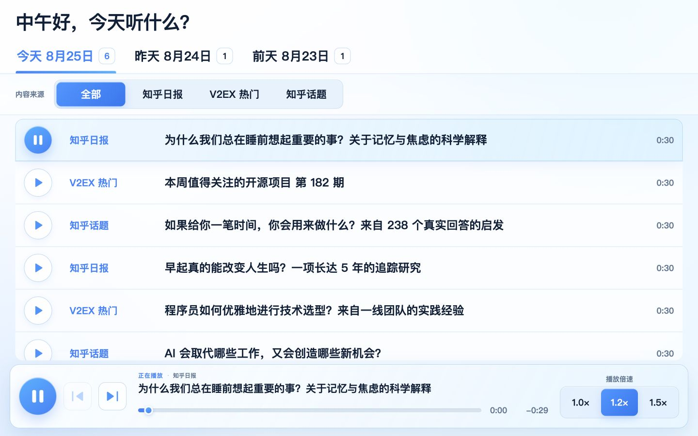
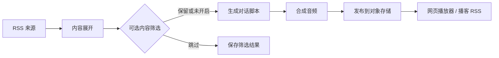

<div align="center">
  
  <h1>rss-pod</h1>
  <p><strong>把来不及读的内容，变成路上能听的播客。</strong></p>
  <p>
    <a href="README.md">English</a>
    ·
    <a href="#快速开始">快速开始</a>
    ·
    <a href="#配置">配置参考</a>
  </p>
  <p>
    <a href="https://github.com/synrise25/rss-pod/actions/workflows/ci.yml"></a>
    <a href="https://github.com/synrise25/rss-pod/pkgs/container/rss-pod"></a>
    
    <a href="LICENSE"></a>
  </p>
</div>

rss-pod 是一个自托管的 RSS 转播客应用：用兼容 OpenAI 协议的 LLM 整理内容、生成多人对话，
通过 Edge TTS 或 Azure Speech 合成音频，提供网页播放器和播客 RSS。通勤、开车或散步时，
戴上耳机就能收听你关心的内容。



## 主要能力

- 支持直接 RSS、派生 RSS、Jina 和 Crawl4AI 内容展开
- 多个 LLM 服务按顺序回退，可在生成前筛选内容
- 自定义对话角色与声音，支持 Edge TTS、Azure Speech 和 Azure MultiTalker
- PostgreSQL + River 保存任务进度，支持自动重试和断点续跑
- S3/MinIO 保存原文、脚本与音频
- 中英文网页播放器，可选管理员页面用于隐藏、恢复节目及查看筛选结果
- 一个 Go 二进制或 Docker 容器即可运行

## 工作流程


```mermaid
flowchart LR
    RSS[RSS 来源] --> Content[内容展开]
    Content --> Screening{可选内容筛选}
    Screening -->|保留或未开启| LLM[生成对话脚本]
    Screening -->|跳过| Skipped[保存筛选结果]
    LLM --> TTS[合成音频]
    TTS --> Publish[发布到对象存储]
    Publish --> Player[网页播放器 / 播客 RSS]
```

进度保存在 PostgreSQL 中；进程重启或外部服务临时失败后，可以从已完成的阶段继续。

## 快速开始

### 1. 准备服务和配置

需要 PostgreSQL、兼容 S3 的对象存储、至少一个兼容 OpenAI 协议的 LLM，以及 Edge TTS
或 Azure Speech。下面使用 Docker 运行，不需要在宿主机安装 Go；这些外部服务需自行准备。

```bash
git clone https://github.com/synrise25/rss-pod.git
cd rss-pod
cp config.example.yaml config.yaml
cp .env.example .env
```

编辑这两个本地文件：

- `.env`：填写数据库、对象存储和所用 LLM 的地址与凭据。
- `config.yaml`：确认数据库名称与存储桶；预先创建 `rsspod-private`、`rsspod-media`
  两个桶，并让 `PUBLIC_MEDIA_BASE_URL` 对应的媒体地址可公开读取。数据库使用普通应用账户。
- 首次使用可只配置 `deepseek` 这一项 LLM 服务，将 `defaults.llm` 设为 `[deepseek]`。
  服务名称可沿用示例，地址和模型可换成任意兼容的提供商。
- 从 `zhihu-daily` 来源开始：将 `feed.url` 换成自己的 RSS 地址，设置 `enabled: true`。
  它使用 Edge TTS，无需配置 Azure。其他来源保持关闭即可。

示例来源默认全部关闭。`check` 会检查数据库、存储，以及已启用来源实际使用的内容服务、
LLM、筛选后端和语音角色；未使用的服务不会发起外部检查。
容器内的数据库和存储地址应使用可达的主机名，不能直接沿用示例中的 `127.0.0.1`。

还没有 LLM 服务？可以使用[硅基流动推广链接](https://cloud.siliconflow.cn/i/eMg5g29e)注册；
符合平台活动条件时，你和维护者均可获得额度奖励。

### 2. 检查并启动

从当前源码构建镜像，确保镜像与配置示例一致：

```bash
docker build -t rss-pod:local .

docker run --rm \
  --env-file .env \
  --volume "$PWD/config.yaml:/app/config.yaml:ro" \
  rss-pod:local check

docker run --rm \
  --env-file .env \
  --volume "$PWD/config.yaml:/app/config.yaml:ro" \
  rss-pod:local migrate

docker run --detach \
  --name rss-pod \
  --restart unless-stopped \
  --publish 127.0.0.1:8080:8080 \
  --env-file .env \
  --volume "$PWD/config.yaml:/app/config.yaml:ro" \
  rss-pod:local run
```

打开 [http://localhost:8080](http://localhost:8080)。播放器支持中文和英文，会根据浏览器语言选择页面。
首次启动尚无节目，需要先触发生成。

### 3. 生成第一集

```bash
docker exec rss-pod rss-pod poll --sources zhihu-daily --limit 1
docker logs -f rss-pod
```

`--sources` 填来源的 `id`，`--limit 1` 表示处理一条 RSS 内容。任务入队后异步生成，
完成后刷新播放器即可收听；之后按来源的 `schedule.cron` 自动拉取。

### 其他运行方式

预构建镜像为 `ghcr.io/synrise25/rss-pod`，支持 `linux/amd64` 和 `linux/arm64`，提供版本标签与
`latest`。使用发行版时，请从[对应 Release](https://github.com/synrise25/rss-pod/releases)
进入同版本的 README 和配置示例。

本机已安装 Go 1.26.2 或兼容的新版本时，也可以在完成上面的配置后直接运行：

```bash
go run ./cmd/rss-pod check
go run ./cmd/rss-pod migrate
go run ./cmd/rss-pod run
```

保持 `run` 运行，在另一个终端执行 `go run ./cmd/rss-pod poll --sources zhihu-daily --limit 1` 生成第一集。

## 使用与可选功能

### 播放器

播放器按任务归属日期分组，排队跨夜和重试不会改变日期；时区由 `defaults.schedule.timezone`
指定。页面默认打开最近有可播放节目的日期，并自动预加载下一集以减少切换等待。
预加载仅在当前页面有效。

### 管理员页面

管理员可在 `/admin` 登录，隐藏／恢复节目，并查看最近跳过的内容。默认关闭；
启用时先生成一个密钥：

```bash
python3 -c 'import base64, secrets; print(base64.b32encode(secrets.token_bytes(20)).decode())'
```

将结果填入 `.env` 的 `RSS_POD_ADMIN_TOTP_SECRET`，再在验证器中添加同一密钥，
选择基于时间的 **SHA-1、6 位数字、30 秒**。登录只需动态码，会话有效期为 30 分钟。
本机运行需重启进程；Docker 部署需重新创建容器以载入新环境变量。

隐藏后，节目从公共播放器和播客 RSS 中移除，原文、脚本和音频保留，未过期的节目可恢复显示；
隐藏不会延长保留期限，也不会撤回已有音频直链、下载或客户端缓存。
遗失验证器时，更换密钥并重启服务，旧会话会失效。保持服务器时间同步。

### 内容筛选

筛选默认关闭。需要时，在 `defaults.screening` 或来源的 `screening` 中将 `enabled` 设为
`true`；`services` 设置独立的有序筛选链，例如 `[llm.deepseek]` 或 `[jev, llm.deepseek]`。
来源可覆盖默认规则；配置字段见 [`config.example.yaml`](config.example.yaml)。

有效的保留／跳过判断立即结束筛选；服务失败会尝试下一项，全部失败则重试。
被跳过的内容不生成脚本或音频，可在管理员页面查看原因。
Jev 需填写 `.env` 中的 `JEV_*` 连接参数，跳过概率达到 `jev.skip_threshold` 时才跳过，
默认阈值为 `0.7`。长内容应配置能容纳输入的备用 LLM；建议固定 Jev 模型版本，避免别名更新后复用旧缓存。

### 播放器通知

复制 `notice.example.md` 为 `notice.md`，设置 `runtime.http.notice_file: notice.md` 即可显示
Markdown 通知。文件为空或不存在时不显示；修改后刷新页面即可生效。
听众关闭通知后，同一内容会保持隐藏，内容更新后重新显示。

Docker 部署时，在启动命令中增加只读挂载：

```bash
--volume "$PWD/notice.md:/app/notice.md:ro" \
```

## 命令与恢复

| 命令 | 用途 |
| --- | --- |
| `check` | 校验配置，检查公共依赖和已启用来源使用的服务 |
| `migrate` | 执行数据库迁移 |
| `poll --sources <id>` | 手动拉取指定来源；`all` 表示全部已启用来源 |
| `run` | 同时运行网页服务、调度器和全部任务队列 |
| `serve` | 只运行网页服务和管理接口 |
| `worker` | 只执行任务队列，可用 `--queues` 指定 |

恢复失败或中断的节目：

```bash
docker exec rss-pod rss-pod poll --sources zhihu-daily --resume-incomplete
```

恢复限于本次 RSS 拉取范围，会复用已保存的内容、脚本和音频片段。
已发布、已筛选跳过或仍有活跃任务的节目不会重复入队。

## 配置

- [`config.example.yaml`](config.example.yaml)：带中英注释的完整配置参考，包含 Crawl4AI、V2EX 内容展开和筛选示例。
- [`.env.example`](.env.example)：连接地址与凭据变量。
- [`notice.example.md`](notice.example.md)：播放器通知示例。
- [`CONTRIBUTING.md`](CONTRIBUTING.md)：开发、测试与贡献说明。

自定义节目角色和声音使用 `dialogue_profiles`，自定义脚本模板使用 `prompts/`。
部署专用 Prompt 可只读挂载到容器的 `/app/prompts`。
真实配置和凭据只保存在本地 `config.yaml`、`.env` 或 secret manager 中，不要提交到仓库。

## 安全边界

播放器监听 `:8080`；配置管理员密钥后，同端口启用需动态码登录的管理员页面。
健康检查、手动拉取、重试和播客管理接口监听 `127.0.0.1:8081`，不要对公网开放或整体反向代理。
线上访问使用 HTTPS；反向代理指向播放器端口，并保留原始 `Host`。

## 项目缘起

本项目受到 [Zenfeed](https://github.com/glidea/zenfeed) 启发。
rss-pod 聚焦自己的自托管播客流程，围绕任务编排和收听体验做了一些不同选择。

## 许可证

本项目使用 [MIT License](LICENSE)。
